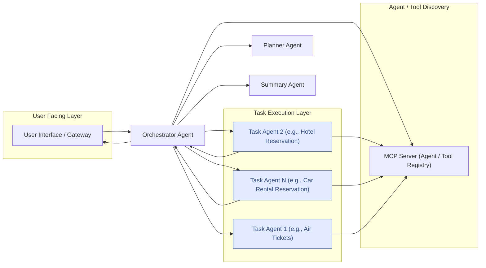

# A2A with MCP as Registry

**Leveraging Model Context Protocol (MCP) as a standardized mechanism for discovering and retrieving Google A2A Agent Cards, enabling dynamic agent interaction using A2A.**

## Table of Contents

- [A2A with MCP as Registry](#a2a-with-mcp-as-registry)
  - [Table of Contents](#table-of-contents)
  - [Objective](#objective)
  - [Background](#background)
    - [A2A Protocol](#a2a-protocol)
    - [Model Context Protocol (MCP)](#model-context-protocol-mcp)
  - [Core Proposal](#core-proposal)
    - [Storing Agent Cards](#storing-agent-cards)
    - [Discovering Agents via MCP](#discovering-agents-via-mcp)
    - [Retrieving Agent Cards](#retrieving-agent-cards)
    - [Finding an Agent for a Task](#finding-an-agent-for-a-task)
    - [Initiating A2A Communication](#initiating-a2a-communication)
  - [Use Case: Orchestrated Task Execution](#use-case-orchestrated-task-execution)
    - [Core Concepts](#core-concepts)
    - [Architectural Components](#architectural-components)
  - [Example Flow: Travel Agent](#example-flow-travel-agent)
  - [Steps to execute the example](#steps-to-execute-the-example)
    - [File/Directory Descriptions](#filedirectory-descriptions)
  - [Disclaimer](#disclaimer)

## Objective

To leverage Model Context Protocol (MCP) as a standardized mechanism for discovering and retrieving Google A2A Agent Cards. This enables dynamic agent interaction, particularly for planning and orchestration agents that utilize the A2A protocol.

## Background

### A2A Protocol

The Agent-to-Agent (A2A) protocol standardizes runtime communication between agents. It defines:

- **Agent Card:** A JSON schema describing an agent's identity, capabilities (actions/functions), and interaction endpoints.
- **Message Formats & Interaction Flows:** Such as `ExecuteTask` for direct agent-to-agent interaction.

### Model Context Protocol (MCP)

MCP defines a standard way for applications (including AI models) to discover, access, and utilize contextual information, referred to as "tools", "resources", etc.

## Core Proposal

The central idea is to use an MCP server as a centralized, queryable repository for A2A Agent Cards.

### Storing Agent Cards

- Each A2A Agent Card (JSON) is stored (e.g., as a JSON file).
- The MCP server exposes these Agent Cards as resources.
- The underlying storage system could be a file system, database or even a vector store. This example uses agent cards stored in a file system, generates embeddings and uses them to find matches.

### Discovering Agents via MCP

- Clients query the MCP server's resource API (`list_resources`) to discover available agent cards.
- Filtering can be applied using additional metadata (e.g., `streaming` support, tags like `currency conversion`), though not explicitly covered in this example.

### Retrieving Agent Cards

- The requesting agent uses resource URIs (obtained from discovery) to fetch the full JSON Agent Card(s) via the MCP server API.

### Finding an Agent for a Task

- Requesting agents can use tools exposed on the MCP server to find the most relevant agent for a specific query.

### Initiating A2A Communication

- Once Agent Card(s) are retrieved, the requesting agent uses them in an A2AClient.
- Agents (like a Planning Agent) needing collaborators then use the standard A2A protocol to communicate directly with target agents.
- MCP is not involved in this direct runtime interaction after discovery.

## Use Case: Orchestrated Task Execution

This system enables a workflow where specialized agents collaborate dynamically.

### Core Concepts

1. **Orchestration:** Planner and Executor agents manage the overall flow of a user query.
2. **Specialization:** Task Agents are experts in specific types of tasks.
3. **Dynamic Discovery:** The MCP Server allows for flexible addition, removal, or updates of Task Agents without modifying the Executor.
4. **Standardized Communication:** The A2A protocol ensures reliable inter-agent communication.

### Architectural Components

1. **User Interface (UI) / Application Gateway:** Entry point for user queries.
2. **Orchestrator Agent:**
   - Receives a structured plan from the Planner Agent.
   - Iterates through tasks.
   - For each task:
     - Queries the MCP Server for a suitable Task Agent based task (additionally capabilities).
     - Connects and sends task details to the Task Agent via A2A.
     - Receives results from the Task Agent via A2A.
     - Manages task state and errors.
   - Validates the results and potentially triggers replanning as needed.
   - Synthesizes, summarizes, and formats results into a coherent user response.
3. **Planner Agent:**
   - Receives the raw user query.
   - Decomposes the query into a structured plan of tasks (potentially a DAG), specifying required capabilities for each.
4. **Model Context Protocol (MCP) Server:**
   - Acts as a registry for Task Agents, hosting their Agent Cards.
   - Provides an interface for the Executor Agent to query for agents.
   - Provides an interface for the Executor Agent to query for tools.
5. **Task Agents (Pool/Fleet):**
   - Independent, specialized agents (e.g., Search Agent, Calculation Agent).
   - Expose A2A-compatible endpoints.
   - Execute tasks and return results to the Executor via A2A.
6. **A2A Communication Layer:** The underlying protocol for inter-agent communication.



## Example Flow: Travel Agent

1. User requests a trip plan.
2. **Orchestrator Agent** receives the request.
   1. Looks up the **Planner Agent**'s card via MCP and connects.
   2. Invokes the Planner Agent to get a detailed plan.
   3. For each step in the plan:
      1. Invokes an MCP tool (e.g., `find_agent`) to fetch the Agent Card of the best Task Agent.
      2. Invokes the selected Task Agent via A2A to execute the task:
         - _Air Tickets:_ Task Agent will use a helper tool from the MCP server. The tool queries a SQLLite database to find the flights.
         - _Hotels:_ Task Agent will use a helper tool from the MCP server.
           The tool queries a SQLLite database to find the hotels.
         - _Car Rental:_ Task Agent will use a helper tool from the MCP server.
           The tool queries a SQLLite database to find the rental cars.
      3. Stores the results in memory
   4. Aggregates results and summarizes them for the client.
   5. If the agent discovers budget mismatch or failures in booking, a re-planning task is kicked off.

## Steps to execute the example

This sample is built using 3 ADK agents to execute the tasks and a LangGraph agent that works as a planner.
All the 3 ADK agents use the same python code but are instantiated with different agent cards.

You can execute the following command to run all of the steps in one terminal:

```sh
bash samples/python/agents/a2a_mcp/run.sh
```

1. Start the MCP Server:

   ```sh
   cd samples/python/agents/a2a_mcp
   uv venv # (if not already done)
   source .venv/bin/activate
   # Runs on port 10100 by default, change as needed by setting the --host and --port parameters.
   uv run  --env-file .env a2a-mcp --run mcp-server --transport sse
   ```

2. Start the Orchestrator Agent:

   In a new terminal window

   ```bash
   cd samples/python/agents/a2a_mcp
   uv venv # (if not already done)
   source .venv/bin/activate
   # Note: Change the host and port as needed.
   uv run --env-file .env src/a2a_mcp/agents/ --agent-card agent_cards/orchestrator_agent.json --port 10101
   ```

3. Start the Planner Agent:

   In a new terminal window

   ```bash
   cd samples/python/agents/a2a_mcp
   uv venv # (if not already done)
   source .venv/bin/activate
   # Note: Change the host and port as needed.
   uv run  --env-file .env src/a2a_mcp/agents/ --agent-card agent_cards/planner_agent.json --port 10102
   ```

4. Start the Airline Ticketing Agent:

   In a new terminal window

   ```bash
   cd samples/python/agents/a2a_mcp
   uv venv # (if not already done)
   source .venv/bin/activate
   # Note: Change the host and port as needed.
   uv run --env-file .env src/a2a_mcp/agents/ --agent-card agent_cards/air_ticketing_agent.json --port 10103
   ```

5. Start the Hotel Reservations Agent:

   In a new terminal window

   ```bash
   cd samples/python/agents/a2a_mcp
   uv venv # (if not already done)
   source .venv/bin/activate
   # Note: Change the host and port as needed.
   uv run  --env-file .env src/a2a_mcp/agents/ --agent-card agent_cards/hotel_booking_agent.json --port 10104
   ```

6. Start the Car Rental Reservations Agent:

   In a new terminal window

   ```bash
   cd samples/python/agents/a2a_mcp
   uv venv  # (if not already done)
   source .venv/bin/activate
   # Note: Change the host and port as needed.
   uv run --env-file .env src/a2a_mcp/agents/ --agent-card agent_cards/car_rental_agent.json --port 10105
   ```

7. Start the cli:

   In a new terminal window

   ```bash
   cd samples/python/agents/a2a_mcp
   uv venv  # (if not already done)
   source .venv/bin/activate

   uv run --env-file .env src/a2a_mcp/mcp/client.py --resource "resource://agent_cards/list" --find_agent "I would like to plan a trip to France."
   ```


### File/Directory Descriptions

- **`agent_cards/`**: This directory stores the JSON schemas for each A2A Agent Card. These cards define the identity, capabilities, and endpoints of the different agents in the system. The MCP server serves these cards.

  - `*_agent.json`: Each JSON file represents a specific agent's card (e.g., `air_ticketing_agent.json` for the agent that handles flight bookings).

- **`src/a2a_mcp/`**: The primary Python source code for this A2A with MCP sample.

  - **`agents/`**: Contains the Python implementations of the different types of agents described in the design document.
    - `__main__.py`: Main script to start up the agent services.
    - `adk_travel_agent.py`: This is the core travel agent built using ADK, different agent cards are used to instantiate the agent.
    - `langgraph_planner_agent.py`: The implementation of the "Planner Agent" using LangGraph, responsible for breaking down user requests into structured plans.
    - `orchestrator_agent.py`: The implementation of the "Orchestrator Agent," which takes the plan from the Planner, discovers appropriate Task Agents via MCP, and invokes them using A2A.
  - **`common/`**: Holds shared code used by multiple agents or parts of the system.
    - `agent_executor.py`: An A2A module to manage the state, dependencies, and execution of tasks within the orchestration flow.
    - `agent_runner.py`: A utility or framework component for running ADK agent instances, managing their lifecycle, and exposing their services.
    - `base_agent.py`: An abstract base class or interface defining common methods and properties for all agents in this project.
    - `prompts.py`: Contains predefined prompt templates used for interacting with Large Language Models (LLMs) within the agents (e.g., for planning or summarization).
    - `types.py`: Defines custom Python data types, Pydantic models, or Enums used across the project (e.g., for representing tasks, agent card structures, or API requests/responses).
    - `utils.py`: A collection of general-purpose utility functions.
    - `workflow.py`: Workflow to manage the process flow.
  - **`mcp/`**: Contains the implementation related to the Model Context Protocol.
    - `client.py`: A helper MCP client library that used to query the MCP server for agent cards or tools. This is a test utility and not used by the agents.
    - `server.py`: The implementation of the MCP server itself. This server hosts the agent cards as resources.

- **`travel_agency.db`**: A light weight SQLLite DB that hosts the demo data.

## Disclaimer
Important: The sample code provided is for demonstration purposes and illustrates the mechanics of the Agent-to-Agent (A2A) protocol. When building production applications, it is critical to treat any agent operating outside of your direct control as a potentially untrusted entity.

All data received from an external agent—including but not limited to its AgentCard, messages, artifacts, and task statuses—should be handled as untrusted input. For example, a malicious agent could provide an AgentCard containing crafted data in its fields (e.g., description, name, skills.description). If this data is used without sanitization to construct prompts for a Large Language Model (LLM), it could expose your application to prompt injection attacks.  Failure to properly validate and sanitize this data before use can introduce security vulnerabilities into your application.

Developers are responsible for implementing appropriate security measures, such as input validation and secure handling of credentials to protect their systems and users.
