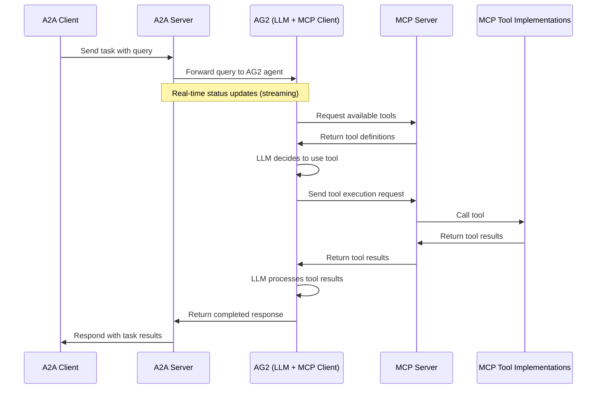

# AG2 MCP Agent with A2A Protocol

This sample demonstrates an MCP-enabled agent built with [AG2](https://github.com/ag2ai/ag2) that is exposed through the A2A protocol. It showcases how different agent frameworks (LangGraph, CrewAI, and now AG2) can communicate using A2A as a lingua franca.

## How It Works

This agent uses AG2's AssistantAgent with MCP (Model Context Protocol) integration to access various tools and capabilities. The A2A protocol enables standardized interaction with the agent, allowing clients to discover and send requests to agents with tools exposed via MCP for complex tasks.



## Key Features

- **Tool Access**: Leverage various MCP tools for complex tasks
- **Web Browsing**: Access to web browsing capabilities
- **Code Execution**: Run Python code for data analysis tasks
- **Image Generation**: Create images from text descriptions
- **Real-time Streaming**: Get status updates during processing
- **Cross-Framework Communication**: Demonstrates A2A's ability to connect different agent frameworks

## Prerequisites

- Python 3.12 or higher
- UV package manager
- OpenAI API Key (for default configuration)
- MCP YouTube server (see installation step below)

## Setup & Running

1. Install the MCP YouTube server:

   ```bash
   uv tool install git+https://github.com/sparfenyuk/mcp-youtube
   ```

2. Navigate to the samples directory:

   ```bash
   cd samples/python/agents/ag2
   ```

3. Create an environment file with your API keys (uses openai gpt-4o):

   ```bash
   echo "OPENAI_API_KEY=your_api_key_here" > .env
   ```

4. Run the agent:

   ```bash
   # Basic run on default port 10003
   uv run .

   # On custom host/port
   uv run . --host 0.0.0.0 --port 8080
   ```

5. In a new terminal, start an A2AClient interface to interact with the remote (ag2) agent using one of these methods:

   a) Run the CLI client (from the samples/python directory):
   ```bash
   cd samples/python
   uv run hosts/cli --agent http://localhost:10003
   ```
   
   b) Use the demo web UI (uses google gemini-2.0-flash-001):
   ```bash
   cd demo/ui
   echo "GOOGLE_API_KEY=your_api_key_here" > .env
   uv run main.py
   ```
   
   Then navigate to the web UI (typically http://localhost:12000):
   - Click the 'Agents' tab
   - Add the Remote Agent
   - Enter the Agent URL: localhost:10003 (or whatever custom host/port)
   - Click the 'Home' tab (Conversations)
   - Create and start a conversation to test the interaction (+)

## Example Usage

The MCP YouTube server enables the agent to download closed captions for YouTube videos (note: does not work for YouTube Shorts). Here's an example prompt you can try:

```
Summarize this video: https://www.youtube.com/watch?v=kQmXtrmQ5Zg (Building Agents with Model Context Protocol - Full Workshop with Mahesh Murag of Anthropic)
```

## Technical Implementation

- **AG2 MCP Integration**: Integrates with MCP toolkit for tool access
- **Streaming Support**: Provides updates during task processing
- **A2A Protocol Integration**: Full compliance with A2A specifications


## Behind the Scenes: A2A Communication

This demo provides two different interfaces to interact with the AG2 agent, both using the A2A protocol:

### CLI Client (Direct Interaction)
When using the CLI client, you interact directly with a simple A2A client that sends requests to the AG2 agent:
```
User → CLI (A2AClient) → AG2 Agent
```

### Web UI (Host Agent Delegation)
When using the web UI, you interact with a Google ADK host agent, which acts as an A2A client to delegate tasks:
```
User → Web UI → ADK Host Agent (A2A Client) → AG2 Agent
```

In both cases, the underlying A2A protocol communication looks like this:

```
POST http://localhost:10003
Content-Type: application/json

{
  "jsonrpc": "2.0",
  "id": 1,
  "method": "tasks/sendSubscribe",
  "params": {
    "id": "mcp-task-01",
    "sessionId": "user-session-123",
    "acceptedOutputModes": [
      "text"
    ],
    "message": {
      "role": "user",
      "parts": [
        {
          "type": "text",
          "text": "Summarize this video: https://www.youtube.com/watch?v=kQmXtrmQ5Zg"
        }
      ]
    }
  }
}
```

This standardized communication format is what enables different agent frameworks to interoperate seamlessly, regardless of whether they're communicating directly or through an orchestrating host agent.

If you want to test the API directly via curl:

```bash
curl -X POST http://localhost:10003 \
-H "Content-Type: application/json" \
-d '{"jsonrpc": "2.0", "id": 1, "method": "tasks/sendSubscribe", "params": {"id": "mcp-task-01", "sessionId": "user-session-123", "acceptedOutputModes": ["text"], "message": {"role": "user", "parts": [{"type": "text", "text": "Summarize this video: https://www.youtube.com/watch?v=kQmXtrmQ5Zg"}]}}}'
```

Note: This agent only supports the async streaming endpoint (`tasks/sendSubscribe`). The synchronous endpoint (`tasks/send`) is not implemented.

## Learn More

- [A2A Protocol Documentation](https://google.github.io/A2A/#/documentation)
- [AG2 Documentation](https://docs.ag2.ai/)
- [MCP Documentation](https://modelcontextprotocol.io/introduction)
