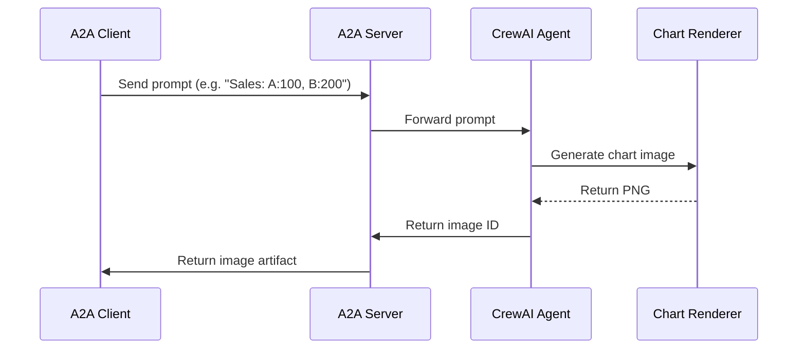

## Analytics Agent with A2A Protocol

This sample demonstrates a lightweight analytics agent that generates **charts** (bar for now; will be enhanced to handle more chart types) from user prompts using [CrewAI](https://www.crewai.com/open-source), `pandas`, and `matplotlib`, and serves them via the [A2A Protocol](https://google.github.io/A2A/#/documentation).

## YouTube [Tutorial](https://www.youtube.com/watch?v=FYEXKh9LxUU&t=9s)

While initially focused on charting, this agent sets the foundation for more advanced analytics workflows.

---

## What It Does

This agent turns simple user prompts (e.g. `"Generate a chart of revenue: Jan,$1000 Feb,$2000 Mar,$1500"`) into visual charts. It uses:

- **Natural language + structured values** → parsed to CSV
- **Chart inference** → preps data for a bar chart
- **Matplotlib rendering** → outputs PNG image
- **CrewAI + A2A** → standardized interaction with external clients

Example result:

> 🧾 Prompt: `Generate a chart of revenue: Jan,$1000 Feb,$2000 Mar,$1500`  
> 📊 Output: PNG image of a chart 

---

## How It Works

The architecture uses CrewAI and optionally the Gemini API (or OpenAI) to interpret prompts and generate visual output. The A2A protocol facilitates communication between the client and the agent.



---

## Key Components

- **CrewAI Agent**: Image generation agent with specialized tools
- **A2A Server**: Provides standardized protocol for interacting with the agent
- **Image Generation**: Uses Gemini API to create images from text descriptions
- **Cache System**: Stores generated images for retrieval (in-memory or file-based)

---

## Prerequisites

- Python 3.12 or higher
- [UV](https://docs.astral.sh/uv/) package manager (recommended)
- Google API Key (for Gemini access)

---

## Setup & Running

1. Navigate to the samples directory:

   ```bash
   cd samples/python/agents/analytics
   ```

2. Create an environment file with your API key (or Vertex AI credentials):

   ```bash
   echo "OPENAI_API_KEY=your_openai_key_here" > .env
   ```

3. Set up the Python environment:

   ```bash
   uv python pin 3.12
   uv venv
   source .venv/bin/activate
   ```

4. Run the agent with desired options:

   ```bash
   # Basic run
   uv run .

   # On custom host/port
   uv run . --host 0.0.0.0 --port 8080
   ```

5. Run the A2A client:

   In a separate terminal:

   ```bash
   cd samples/python/hosts/cli
   uv run . --agent http://localhost:10011
   ```

   If you changed the agent's port when starting it, update the URL accordingly:

   ```bash
   uv run . --agent http://localhost:YOUR_PORT
   ```

   Or run the [demo app](/A2A/A2A/demo/README.md)

---

## Features & Improvements

**Features:**

- Text-to-chart-image generation using Google Gemini and Matplotlib
- Support for OpenAI and Gemini LLMs
- Robust error handling with automatic retries
- Optional file-based cache persistence
- Improved artifact ID extraction from queries
- Returns PNG images directly to the client
- A2A protocol compatibility

**Limitations:**

- No true streaming (CrewAI doesn't natively support it)
- Limited agent interactions (no multi-turn conversations)

---

## Learn More

- [A2A Protocol Documentation](https://google.github.io/A2A/#/documentation)
- [CrewAI Documentation](https://docs.crewai.com/introduction)
- [Google Gemini API](https://ai.google.dev/gemini-api)
- [Matplotlib Documentation](https://matplotlib.org/stable/index.html)

---

## By

Gabe Jakobson, 2025