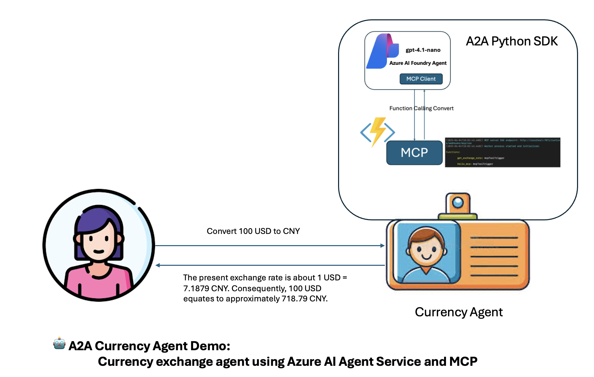

# 🤖 A2A Currency Agent Demo: Currency exchange agent using Azure AI Agent Service and MCP

This proj**🏗️ Core Components:**
- `CurrencyAgent`: Main agent class that handles Azure AI Foundry integration
- `CurrencyAgentExecutor`: A2A executor for handling agent execution workflows
- `MCPToolManager`: Manages MCP tool connections and interactions
- `A2AStarletteApplication`: Web server implementation for A2A communication



## 📦 Key Dependencies

### 🔌 MCP Serverstrates how to create an AI agent using Azure AI Foundry Agent Service and Model Context Protocol (MCP) service and integrate with Google's Agent to Agent (A2A) Python SDK to build a currency exchange agent based on the A2A protocol.

## 📋 Project Overview

This demo showcases the integration of multiple cutting-edge AI technologies:

- **🎯 Azure AI Agent Service**: Leverages Azure AI Foundry for intelligent agent capabilities
- **🔧 Model Context Protocol (MCP)**: Implements standardized tool communication protocols
- **🤝 Google A2A SDK**: Provides agent-to-agent communication framework
- **☁️ Azure Functions**: Hosts MCP services in a serverless environment

## 🏗️ Architecture

The project consists of two main components that work together to provide currency exchange services:

1. **🔌 MCP Server** (`mcp_server/`): Azure Functions-based MCP service that provides currency exchange tools
2. **💱 Currency Agent** (`currencyagent/`): Use Azure AI Foundry SDK to connect to MCP service Create an A2A protocol-based agent using Google A2A Python SDK

## 📁 Project Structure

```
aiagentdemo/
├── 📄 README.md                           # Introduction
├── 🔌 mcp_server/                         # MCP Service (Azure Functions)
│   ├── function_app.py                 # Main Azure Function app with MCP tools
│   ├── host.json                       # Azure Functions host configuration
│   ├── local.settings.json             # Local development settings
│   └── requirements.txt                # Python dependencies for Azure Functions
└── 💱 currencyagent/                      # Currency Exchange Agent
    ├── __init__.py                     # Package initialization
    ├── __main__.py                     # Main entry point and A2A server setup
    ├── agent.py                        # Core CurrencyAgent class with Azure AI Foundry Agent Service SDK integration
    ├── agent_executor.py               # A2A agent executor implementation
    ├── pyproject.toml                  # Project configuration and dependencies
    ├── README.md                       # Component-specific documentation
    ├── uv.lock                         # Dependency lock file
    ├── .env.examples                   # set your env config, including Azure AI Foundry Service Endpoint, Azure AI Foundry Model Deployments, Your MCP Endpoint. copy this content to .env
    └── utils/                          # Utility modules
        ├── __init__.py                 # Utils package initialization
        ├── mcp_tool_manager.py         # MCP tool management utilities
        └── server_connection.py        # Server connection management
```

## 🔧 Components Detail

### 1. 🔌 MCP Server (Azure Functions)

The MCP server is implemented as an Azure Functions application that provides standardized tools for currency exchange operations.

**✨ Key Features:**
- **👋 Hello MCP Tool**: A simple greeting function for testing MCP connectivity
- **💰 Exchange Rate Tool**: Fetches real-time currency exchange rates using the Frankfurter API
- **⚡ Serverless Architecture**: Deployed on Azure Functions for scalability and cost-effectiveness
- **🔄 Standardized Protocol**: Implements MCP specifications for tool communication

**🛠️ Tools Available:**
- `hello_mcp`: Basic connectivity test tool
- `get_exchange_rate`: Currency conversion tool that accepts `currency_from` and `currency_to` parameters


**🚀 Running:**

- Running your Azure Blob Storage in Docker

```
docker run -p 10000:10000 -p 10001:10001 -p 10002:10002 \                 
    mcr.microsoft.com/azure-storage/azurite
```

- Start Azure Function 

```
func start
```

- Testing your MCP Service with VSCode or MCP Inspector


### 2. 💱 Currency Agent (Azure AI Foundry + A2A)

The currency agent is an intelligent assistant specifically designed for currency exchange queries, built using Azure AI Foundry Agent Service and integrated with Google's A2A framework.

**✨ Key Features:**
- **🎯 Specialized AI Agent**: Focused solely on currency conversion and exchange rate queries
- **🔗 Azure AI Integration**: Uses Azure AI Foundry Agent Service for intelligent responses
- **🔧 MCP Tool Integration**: Connects to MCP server for accessing currency exchange tools
- **🤝 A2A Framework**: Implements Google's Agent-to-Agent communication protocol
- **📡 Streaming Responses**: Provides real-time streaming responses to user queries
- **📋 Task Management**: Handles task states including input requirements and completion status

**🏗️ Core Components:**
- `CurrencyAgent`: Main agent class that handles Azure AI Foundry integration
- `CurrencyAgentExecutor`: A2A executor for handling agent execution workflows
- `MCPToolManager`: Manages MCP tool connections and interactions
- `A2AStarletteApplication`: Web server implementation for A2A communication


**🚀 Running:**

- Running Agent

```
uv run .
```

or

```
# On custom host/port
uv run . --host 0.0.0.0 --port 8080
```

- Testing in Thunder Client VS Code Extension 

  - INPUT Endpoint http://localhost:47128

  - Add Post Body

```json
{
  "jsonrpc": "2.0",
  "id": 1,
  "method": "message/send",
  "params": {
    "message": {
      "role": "user",
      "parts": [
        {
          "kind": "text",
          "text": "Convert 100 USD to CNY"
        }
      ],
      "messageId": "9229e770-767c-417b-a0b0-f0741243c589"
    },
    "metadata": {}
  }
}
```
  - Get Result


```json
{
  "id": 1,
  "jsonrpc": "2.0",
  "result": {
    "artifacts": [
      {
        "artifactId": "02ba1828-8faa-4e53-8c89-237998c054ae",
        "description": "Result of request to agent.",
        "name": "current_result",
        "parts": [
          {
            "kind": "text",
            "text": "The current exchange rate is approximately 1 USD = 7.1879 CNY. Therefore, 100 USD is roughly 718.79 CNY."
          }
        ]
      }
    ],
    "contextId": "b797cfb0-e94c-4727-ae65-a00de325f395",
    "history": [
      {
        "contextId": "b797cfb0-e94c-4727-ae65-a00de325f395",
        "kind": "message",
        "messageId": "9229e770-767c-417b-a0b0-f0741243c589",
        "parts": [
          {
            "kind": "text",
            "text": "Convert 100 USD to CNY"
          }
        ],
        "role": "user",
        "taskId": "845b7ceb-5cdb-431f-85e5-0d2129145f3e"
      },
      {
        "contextId": "b797cfb0-e94c-4727-ae65-a00de325f395",
        "kind": "message",
        "messageId": "da1c935b-1366-4e7d-b72d-cf81ea8fbf49",
        "parts": [
          {
            "kind": "text",
            "text": "Working on your request..."
          }
        ],
        "role": "agent",
        "taskId": "845b7ceb-5cdb-431f-85e5-0d2129145f3e"
      },
      {
        "contextId": "b797cfb0-e94c-4727-ae65-a00de325f395",
        "kind": "message",
        "messageId": "45606d7e-40c4-4832-a8c4-d5dc0ae41774",
        "parts": [
          {
            "kind": "text",
            "text": "Processing data sources..."
          }
        ],
        "role": "agent",
        "taskId": "845b7ceb-5cdb-431f-85e5-0d2129145f3e"
      }
    ],
    "id": "845b7ceb-5cdb-431f-85e5-0d2129145f3e",
    "kind": "task",
    "status": {
      "state": "completed"
    }
  }
}
```


## 📦 Key Dependencies

### 🔌 MCP Server
- `azure-functions`: Azure Functions runtime
- `httpx`: HTTP client for external API calls

### 💱 Currency Agent
- `a2a-sdk>=0.2.5`: Google Agent-to-Agent SDK
- `azure-ai-agents>=1.0.0`: Azure AI Agent Service SDK
- `azure-ai-projects>=1.0.0b11`: Azure AI Projects SDK
- `azure-identity>=1.23.0`: Azure authentication
- `mcp>=1.9.2`: Model Context Protocol implementation
- `starlette>=0.47.0`: Web framework for A2A server
- `uvicorn>=0.34.3`: ASGI server

## 💡 Usage Scenarios

This demo is perfect for understanding:

1. **🔧 MCP Implementation**: How to create and deploy MCP services using Azure Functions
2. **🎯 Azure AI Agent Integration**: Building intelligent agents with Azure AI Foundry
3. **🤝 A2A Communication**: Implementing agent-to-agent communication protocols
4. **🔗 Tool Integration**: Connecting AI agents with external tools and services
5. **☁️ Serverless AI Architecture**: Designing scalable AI solutions using serverless technologies

## 📚 Learning

1. **⚡ Azure Function Python for MCP** [https://learn.microsoft.com/en-us/samples/azure-samples/remote-mcp-functions-python/remote-mcp-functions-python/](https://learn.microsoft.com/en-us/samples/azure-samples/remote-mcp-functions-python/remote-mcp-functions-python/)

2. **🎯 Azure AI Foundry Agent Service** [https://learn.microsoft.com/en-us/azure/ai-services/agents/overview](https://learn.microsoft.com/en-us/azure/ai-services/agents/overview)

3. **🤝 Google A2A** [https://a2a-protocol.org/](https://a2a-protocol.org/)

4. **🐍 Google A2A Python SDK** [https://github.com/a2aproject/a2a-python](https://github.com/a2aproject/a2a-python)
