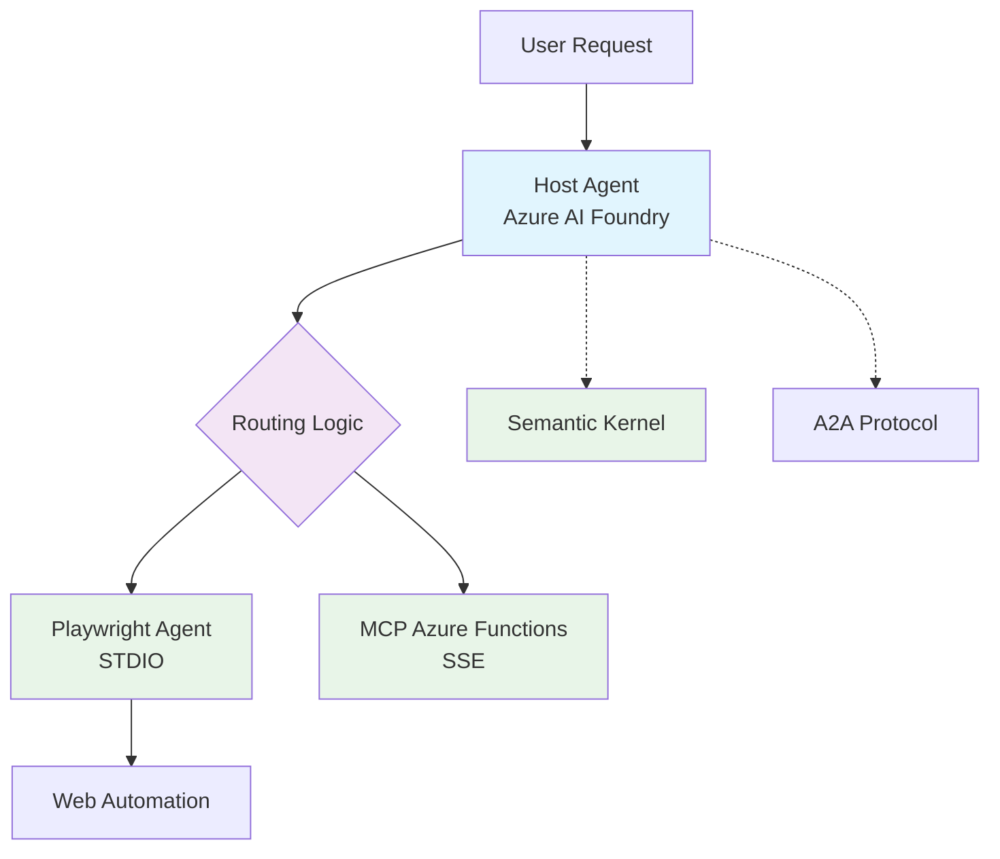

# Multi-Agent System with Azure AI Foundry

A sophisticated multi-agent system that leverages Azure AI Foundry, A2A (Agent-to-Agent), Semantic Kernel, and Model Context Protocol (MCP) for intelligent task routing and delegation to specialized remote agents.

## 🚀 Overview

This project implements a A2A multi-agent architecture where a central routing agent powered by Azure AI Foundry intelligently delegates tasks to specialized remote agents. The system supports various agent types including  Playwright automation agents(STDIO), and MCP-enabled Azure Functions(SSE).

## 🏗️ Architecture



**Key Components:**
- **Host Agent**: Central routing system powered by Azure AI Foundry
- **A2A Protocol**: Agent-to-Agent communication standard
- **Semantic Kernel**: Advanced agent framework
- **Remote Agents**: Specialized task executors (Playwright, MCP)
- **MCP Integration**: Model Context Protocol for extensible functionality （Azure Function）

## 📂 Project Structure

```
multi_agent/
├── host_agent/                 # Central routing agent
│   ├── __main__.py            # Gradio web interface
│   ├── routing_agent.py       # Core routing logic with Azure AI
│   ├── remote_agent_connection.py  # A2A protocol handling
│   ├── diagnose_azure.py      # Azure diagnostics
│   └── validate_setup.py      # Setup validation
├── remote_agents/             # Specialized agent implementations
│   ├── playwright_agent/      # Web automation agent
│   └── tool_agent/           # General-purpose tool agent
└── mcp_sse_server/           # MCP server implementations
    └── MCPAzureFunc/         # Azure Functions MCP server
```

## 🚀 Features

### Host Agent (Routing System)
- **Azure AI Agents Integration**: Powered by Azure AI Foundry for intelligent decision making
- **A2A Protocol Support**: Agent-to-Agent communication using standardized protocols
- **Semantic Kernel Integration**: Advanced semantic understanding and routing
- **Web Interface**: Modern Gradio-based chat interface with real-time streaming
- **Multi-Agent Coordination**: Intelligent task delegation and response aggregation
- **Resource Management**: Automatic cleanup and comprehensive error handling

### Remote Agents
- **Playwright Agent**: Web automation and browser-based task execution
- **MCP Integration**: Model Context Protocol support for extensible functionality

### MCP Server Components
- **Azure Functions Integration**: Serverless MCP server deployment
- **Git Repository Management**: Automated repository cloning and management
- **Extensible Architecture**: Easy addition of new MCP tools and capabilities

## 📋 Prerequisites

### Required Services
1. **Azure AI Foundry Project** with deployed language model
2. **Azure Authentication** configured (CLI, Service Principal, or Managed Identity)
3. **Python 3.13+** for all components

### Optional Components
- **Azure Functions** for MCP server deployment
- **Docker** for containerized deployments

## ⚙️ Installation & Setup

### 1. Clone the Repository
```bash
git clone <repository-url>
cd multi_agent
```

### 2. MCP Server Setup 

```bash
cd mcp_sse_server/MCPAzureFunc

docker run -p 10000:10000 -p 10001:10001 -p 10002:10002 \          
    mcr.microsoft.com/azure-storage/azurite

# Open another tab in terminal
func start 
```


### 3. Remote Agents Setup
```bash
# Playwright Agent
cd remote_agents/playwright_agent
uv sync
uv run .

# Tool Agent  
cd ../tool_agent
uv sync
uv run .
```

### 4. Host Agent Setup
```bash
cd host_agent
uv sync
uv run .
```

## ⚙️ Configuration

### Environment Variables
Create a `.env` file by copying from the example template:

```bash
cd host_agent
cp .env.example .env
```

## 🚀 Usage

### Starting the System

1. **Access Web Interface**:
   Open your browser to `http://0.0.0.0:8083/`

### Example Interactions

- **Web Automation**: "Navigate to example.com and take a screenshot"
- **Multi-Agent Tasks**: "Research competitors and create a summary report"

## 🔄 Version History

- **v0.1.0**: Initial release with basic multi-agent routing
- **Current**: Enhanced Azure AI integration and MCP support