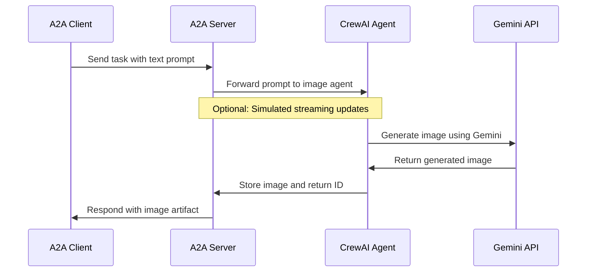

## CrewAI Agent with A2A Protocol

This sample demonstrates a simple image generation agent built with [CrewAI](https://www.crewai.com/open-source) and exposed through the A2A protocol.

## How It Works

This agent utilizes CrewAI and the Google Gemini API to generate images based on text prompts. The A2A protocol enables standardized interaction with the agent, allowing clients to send requests and receive images as artifacts.



## Key Components

- **CrewAI Agent**: Image generation agent with specialized tools
- **A2A Server**: Provides standardized protocol for interacting with the agent
- **Image Generation**: Uses Gemini API to create images from text descriptions
- **Cache System**: Stores generated images for retrieval (in-memory or file-based)

## Prerequisites

- Python 3.12 or higher
- [UV](https://docs.astral.sh/uv/) package manager (recommended)
- Google API Key (for Gemini access)

## Setup & Running

1. Navigate to the samples directory:

   ```bash
   cd samples/python/agents/crewai
   ```

2. Create an environment file with your API key:

   ```bash
   echo "GOOGLE_API_KEY=your_api_key_here" > .env
   ```

3. Set up the Python environment:

   ```bash
   uv python pin 3.12
   uv venv
   source .venv/bin/activate
   ```

4. Run the agent with desired options:

   ```bash
   # Basic run
   uv run .

   # On custom host/port
   uv run . --host 0.0.0.0 --port 8080
   ```

5. In a separate terminal, run the A2A client:

   ```bash
   # Connect to the agent (specify the agent URL with correct port)
   cd samples/python/hosts/cli   
   uv run . --agent http://localhost:10001
   
   # If you changed the port when starting the agent, use that port instead
   # uv run . --agent http://localhost:YOUR_PORT
   ```

## Features & Improvements

**Features:**

- Text-to-image generation using Google Gemini
- Support for modifying existing images using references
- Robust error handling with automatic retries
- Optional file-based cache persistence
- Improved artifact ID extraction from queries

**Limitations:**

- No true streaming (CrewAI doesn't natively support it)
- Limited agent interactions (no multi-turn conversations)

## Learn More

- [A2A Protocol Documentation](https://google.github.io/A2A/#/documentation)
- [CrewAI Documentation](https://docs.crewai.com/introduction)
- [Google Gemini API](https://ai.google.dev/gemini-api)
