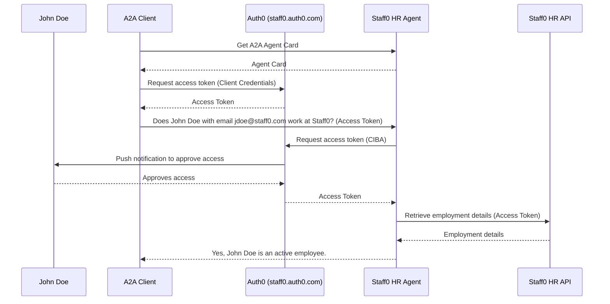

# Auth for Headless Agents

This sample demonstrates how headless agent's tools can leverage [Auth0's Client-Initiated Backchannel Authentication (CIBA) flow](https://auth0.com/docs/get-started/authentication-and-authorization-flow/client-initiated-backchannel-authentication-flow) to request user authorization via push notification and obtain tokens for accessing separate APIs.

Additionally, it shows agent-level authorization via the [OAuth 2.0 Client Credentials flow](https://auth0.com/docs/get-started/authentication-and-authorization-flow/client-credentials-flow).

## How It Works

Allows an A2A client to securely interact with an external HR agent owned by the fictional company Staff0 to verify whether the provided user data corresponds to an active employee.

With the authorization of the employee involved (via push notification), the Staff0 HR agent can access the company's internal HR API to retrieve employment details.



## Prerequisites

- Python 3.12 or higher
- [UV](https://docs.astral.sh/uv/)
- [Gemini API key](https://ai.google.dev/gemini-api/docs/api-key)
- An [Auth0](https://auth0.com/) tenant with the following configuration:
  - **APIs**
    - HR API
      - Audience: `https://staff0/api`
      - Permissions: `read:employee`
    - HR Agent
      - Audience: `https://staff0/agent`
      - Permissions: `read:employee_status`
  - **Applications**
    - A2A Client
      - Grant Types: `Client Credentials`
      - APIs: `HR Agent` (enabled permissions: `read:employee_status`)
    - HR Agent
      - Grant Types: `Client Initiated Backchannel Authentication (CIBA)`
      - APIs: `Auth0 Management API` (enabled permissions: `read:users`)
  - Push Notifications using [Auth0 Guardian](https://auth0.com/docs/secure/multi-factor-authentication/auth0-guardian) must be `enabled`.
  - A test user enrolled in Guardian MFA.

## Running the Sample

1. Create a `.env` file by copying [.env.example](.env.example), and provide the required environment variable values.

2. Start HR Agent and HR API:

   ```bash
   uv run --prerelease=allow .
   ```

3. Run the test client:
   ```bash
   uv run --prerelease=allow test_client.py
   ```

## Disclaimer
Important: The sample code provided is for demonstration purposes and illustrates the mechanics of the Agent-to-Agent (A2A) protocol. When building production applications, it is critical to treat any agent operating outside of your direct control as a potentially untrusted entity.

All data received from an external agent—including but not limited to its AgentCard, messages, artifacts, and task statuses—should be handled as untrusted input. For example, a malicious agent could provide an AgentCard containing crafted data in its fields (e.g., description, name, skills.description). If this data is used without sanitization to construct prompts for a Large Language Model (LLM), it could expose your application to prompt injection attacks.  Failure to properly validate and sanitize this data before use can introduce security vulnerabilities into your application.

Developers are responsible for implementing appropriate security measures, such as input validation and secure handling of credentials to protect their systems and users.