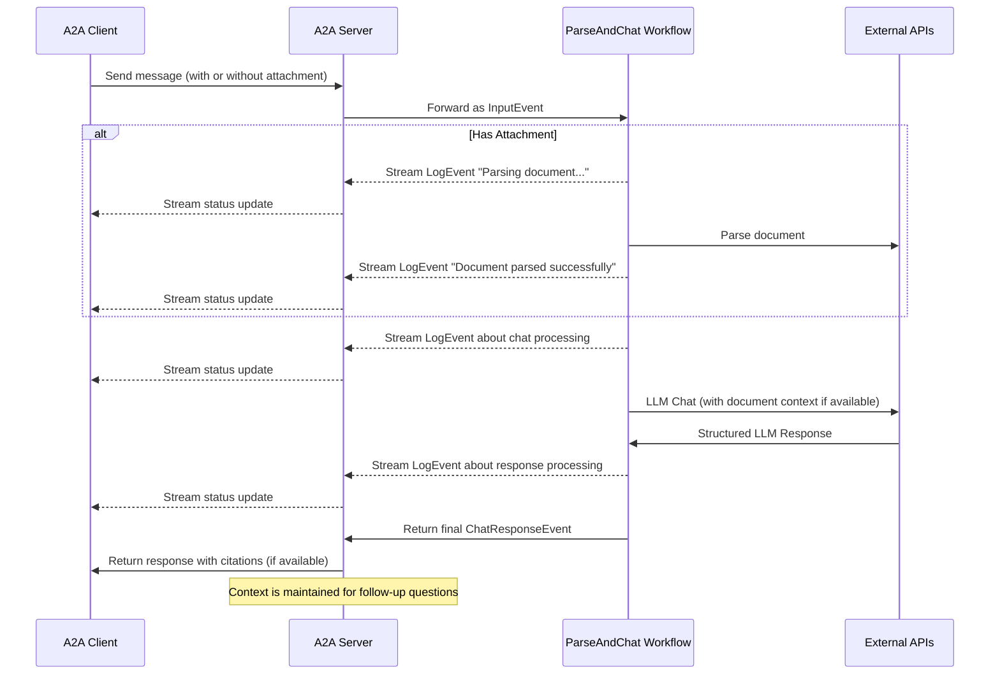

# LlamaIndex File Chat Workflow with A2A Protocol

This sample demonstrates a conversational agent built with [LlamaIndex Workflows](https://docs.llamaindex.ai/en/stable/understanding/workflows/) and exposed through the A2A protocol. It showcases file upload and parsing, conversational interactions with support for multi-turn dialogue, streaming responses/updates, and in-line citations.

## How It Works

This agent uses LlamaIndex Workflows with Google Gemini to provide a conversational agent that can upload files, parse them, and answer questions about the content. The A2A protocol enables standardized interaction with the agent, allowing clients to send requests and receive real-time updates.



## Key Features

- **File Upload**: Clients can upload files and parse them to provide context to the chat
- **Multi-turn Conversations**: Agent can request additional information when needed
- **Real-time Streaming**: Provides status updates during processing
- **Push Notifications**: Support for webhook-based notifications
- **Conversational Memory**: Maintains context across interactions in the same session
- **LlamaParse Integration**: Uses LlamaParse to parse files accurately

**NOTE:** This sample agent accepts multimodal inputs, but at the time of writing, the sample UI only supports text inputs. The UI will become multimodal in the future to handle this and other use cases.

## Prerequisites

- Python 3.12 or higher
- [UV](https://docs.astral.sh/uv/)
- Access to an LLM and API Key (Current code assumes using Google Gen AI API)
- A LlamaParse API key ([get one for free](https://cloud.llamaindex.ai))

## Setup & Running

1. Navigate to the samples directory:

   ```bash
   cd samples/python/agents/llama_index_file_chat
   ```

2. Create an environment file with your API keys:

   ```bash
   echo "GOOGLE_API_KEY=your_api_key_here" >> .env
   echo "LLAMA_CLOUD_API_KEY=your_api_key_here" >> .env
   ```

3. Run the agent:

   ```bash
   # Basic run on default port 10010
   uv run .

   # On custom host/port
   uv run . --host 0.0.0.0 --port 8080
   ```

4. In a separate terminal, run an A2A [client](/samples/python/hosts/README.md):

   ```bash
   cd samples/python/hosts/cli
   uv run . --agent http://localhost:10010
   ```

   Download a file to parse, or link to your own file. For example:

   ```bash
   wget https://arxiv.org/pdf/1706.03762 -O attention.pdf
   ```

   And enter something like the following:

   ```bash
   ======= Agent Card ========
   {"name":"Parse and Chat","description":"Parses a file and then chats with a user using the parsed content as context.","url":"http://localhost:10010/","version":"1.0.0","capabilities":{"streaming":true,"pushNotifications":true,"stateTransitionHistory":false},"defaultInputModes":["text","text/plain"],"defaultOutputModes":["text","text/plain"],"skills":[{"id":"parse_and_chat","name":"Parse and Chat","description":"Parses a file and then chats with a user using the parsed content as context.","tags":["parse","chat","file","llama_parse"],"examples":["What does this file talk about?"]}]}
   =========  starting a new task ======== 

   What do you want to send to the agent? (:q or quit to exit): What does this file talk about?
   Select a file path to attach? (press enter to skip): ./attention.pdf
   ```

## Technical Implementation

- **LlamaIndex Workflows**: Uses a custom workflow to parse the file and then chat with the user
- **Streaming Support**: Provides incremental updates during processing
- **Serializable Context**: Maintains conversation state between turns, can optionally be persisted to redis, mongodb, to disk, etc.
- **Push Notification System**: Webhook-based updates with JWK authentication
- **A2A Protocol Integration**: Full compliance with A2A specifications

## Limitations

- Only supports text-based output
- LlamaParse is free for the first 10K credits (~3333 pages with basic settings)
- Memory is session-based and in-memory, and therefore not persisted between server restarts
- Inserting the entire document into the context window is not scalable for larger files. You may want to deploy a vector DB or use a cloud DB to run retrieval over one or more files for effective RAG. LlamaIndex integrates with a [ton of vector DBs and cloud DBs](https://docs.llamaindex.ai/en/stable/examples/#vector-stores).

## Examples

**Synchronous request**

Request:

```
POST http://localhost:10010
Content-Type: application/json

{
  "jsonrpc": "2.0",
  "id": 11,
  "method": "tasks/send",
  "params": {
    "id": "129",
    "sessionId": "8f01f3d172cd4396a0e535ae8aec6687",
    "acceptedOutputModes": [
      "text"
    ],
    "message": {
      "role": "user",
      "parts": [
        {
          "type": "text",
          "text": "What does this file talk about?"
        },
        {
            "type": "file",
            "file": {
                "bytes": "...",
                "name": "attention.pdf"
            }
        }
      ]
    }
  }
}
```

Response:

```
{
  "jsonrpc": "2.0",
  "id": 11,
  "result": {
    "id": "129",
    "status": {
      "state": "completed",
      "timestamp": "2025-04-02T16:53:29.301828"
    },
    "artifacts": [
      {
        "parts": [
          {
            "type": "text",
            "text": "This file is about XYZ... [1]"
          }
        ],
        "metadata": {
            "1": ["Text for citation 1"]
        }
        "index": 0,
      }
    ],
  }
}
```

**Multi-turn example**

Request - Seq 1:

```
POST http://localhost:10010
Content-Type: application/json

{
  "jsonrpc": "2.0",
  "id": 11,
  "method": "tasks/send",
  "params": {
    "id": "129",
    "sessionId": "8f01f3d172cd4396a0e535ae8aec6687",
    "acceptedOutputModes": [
      "text"
    ],
    "message": {
      "role": "user",
      "parts": [
        {
          "type": "text",
          "text": "What does this file talk about?"
        },
        {
            "type": "file",
            "file": {
                "bytes": "...",
                "name": "attention.pdf"
            }
        }
      ]
    }
  }
}
```

Response - Seq 2:

```
{
  "jsonrpc": "2.0",
  "id": 11,
  "result": {
    "id": "129",
    "status": {
      "state": "completed",
      "timestamp": "2025-04-02T16:53:29.301828"
    },
    "artifacts": [
      {
        "parts": [
          {
            "type": "text",
            "text": "This file is about XYZ... [1]"
          }
        ],
        "metadata": {
            "1": ["Text for citation 1"]
        }
        "index": 0,
      }
    ],
  }
}
```

Request - Seq 3:

```
POST http://localhost:10010
Content-Type: application/json

{
  "jsonrpc": "2.0",
  "id": 11,
  "method": "tasks/send",
  "params": {
    "id": "130",
    "sessionId": "8f01f3d172cd4396a0e535ae8aec6687",
    "acceptedOutputModes": [
      "text"
    ],
    "message": {
      "role": "user",
      "parts": [
        {
          "type": "text",
          "text": "What about thing X?"
        }
      ]
    }
  }
}
```

Response - Seq 4:

```
{
  "jsonrpc": "2.0",
  "id": 11,
  "result": {
    "id": "130",
    "status": {
      "state": "completed",
      "timestamp": "2025-04-02T16:53:29.301828"
    },
    "artifacts": [
      {
        "parts": [
          {
            "type": "text",
            "text": "Thing X is ... [1]"
          }
        ],
        "metadata": {
            "1": ["Text for citation 1"]
        }
        "index": 0,
      }
    ],
  }
}
```

**Streaming example**

Request:

```
{
  "jsonrpc": "2.0",
  "id": 11,
  "method": "tasks/send",
  "params": {
    "id": "129",
    "sessionId": "8f01f3d172cd4396a0e535ae8aec6687",
    "acceptedOutputModes": [
      "text"
    ],
    "message": {
      "role": "user",
      "parts": [
        {
          "type": "text",
          "text": "What does this file talk about?"
        },
        {
            "type": "file",
            "file": {
                "bytes": "...",
                "name": "attention.pdf"
            }
        }
      ]
    }
  }
}
```

Response:

```
stream event => {"jsonrpc":"2.0","id":"367d0ba9af97457890261ac29a0f6f5b","result":{"id":"373b26d64c5a4f0099fa906c6b7342d9","status":{"state":"working","message":{"role":"agent","parts":[{"type":"text","text":"Parsing document..."}]},"timestamp":"2025-04-15T16:05:18.283682"},"final":false}}

stream event => {"jsonrpc":"2.0","id":"367d0ba9af97457890261ac29a0f6f5b","result":{"id":"373b26d64c5a4f0099fa906c6b7342d9","status":{"state":"working","message":{"role":"agent","parts":[{"type":"text","text":"Document parsed successfully."}]},"timestamp":"2025-04-15T16:05:24.200133"},"final":false}}

stream event => {"jsonrpc":"2.0","id":"367d0ba9af97457890261ac29a0f6f5b","result":{"id":"373b26d64c5a4f0099fa906c6b7342d9","status":{"state":"working","message":{"role":"agent","parts":[{"type":"text","text":"Chatting with 1 initial messages."}]},"timestamp":"2025-04-15T16:05:24.204757"},"final":false}}

stream event => {"jsonrpc":"2.0","id":"367d0ba9af97457890261ac29a0f6f5b","result":{"id":"373b26d64c5a4f0099fa906c6b7342d9","status":{"state":"working","message":{"role":"agent","parts":[{"type":"text","text":"Inserting system prompt..."}]},"timestamp":"2025-04-15T16:05:24.204810"},"final":false}}

stream event => {"jsonrpc":"2.0","id":"367d0ba9af97457890261ac29a0f6f5b","result":{"id":"373b26d64c5a4f0099fa906c6b7342d9","status":{"state":"working","message":{"role":"agent","parts":[{"type":"text","text":"LLM response received, parsing citations..."}]},"timestamp":"2025-04-15T16:05:26.084829"},"final":false}}

stream event => {"jsonrpc":"2.0","id":"367d0ba9af97457890261ac29a0f6f5b","result":{"id":"373b26d64c5a4f0099fa906c6b7342d9","artifact":{"parts":[{"type":"text","text":"This file discusses the Transformer, a novel neural network architecture based solely on attention mechanisms, dispensing with recurrence and convolutions entirely [1]. The document compares the Transformer to recurrent and convolutional layers [2], details the model architecture [3], and presents results from machine translation and English constituency parsing tasks [4]."}],"metadata":{"1":["The dominant sequence transduction models are based on complex recurrent or convolutional neural networks that include an encoder and a decoder. The best performing models also connect the encoder and decoder through an attention mechanism. We propose a new simple network architecture, the Transformer, based solely on attention mechanisms, dispensing with recurrence and convolutions entirely. Experiments on two machine translation tasks show these models to be superior in quality while being more parallelizable and requiring significantly less time to train. Our model achieves 28.4 BLEU on the WMT 2014 English-to-German translation task, improving over the existing best results, including ensembles, by over 2 BLEU. On the WMT 2014 English-to-French translation task, our model establishes a new single-model state-of-the-art BLEU score of 41.8 after training for 3.5 days on eight GPUs, a small fraction of the training costs of the best models from the literature. We show that the Transformer generalizes well to other tasks by applying it successfully to English constituency parsing both with large and limited training data."],"2":["In this section we compare various aspects of self-attention layers to the recurrent and convolutional layers commonly used for mapping one variable-length sequence of symbol representations (x1, ..., xn) to another sequence of equal length (z1, ..., zn), with xi, zi ∈ Rd, such as a hidden layer in a typical sequence transduction encoder or decoder. Motivating our use of self-attention we consider three desiderata.",""],"3":["# 3 Model Architecture"],"4":["# 6   Results"]},"index":0,"append":false}}}

stream event => {"jsonrpc":"2.0","id":"367d0ba9af97457890261ac29a0f6f5b","result":{"id":"373b26d64c5a4f0099fa906c6b7342d9","status":{"state":"completed","timestamp":"2025-04-15T16:05:26.111314"},"final":true}}
```

You can see that the workflow produced an artifact with in-line citations, and the source text of those citations is included in the metadata of the artifact. If we send more responses in the same session, the agent will remember the previous messages and continue the conversation.

## Learn More

- [A2A Protocol Documentation](https://google.github.io/A2A/#/documentation)
- [LlamaIndex Workflow Documentation](https://docs.llamaindex.ai/en/stable/understanding/workflows/)
- [LlamaIndex Workflow Examples](https://docs.llamaindex.ai/en/stable/examples/#agentic-workflows)
- [LlamaParse Documentation](https://github.com/run-llama/llama_cloud_services/blob/main/parse.md)
- [Google Gemini API](https://ai.google.dev/gemini-api)
