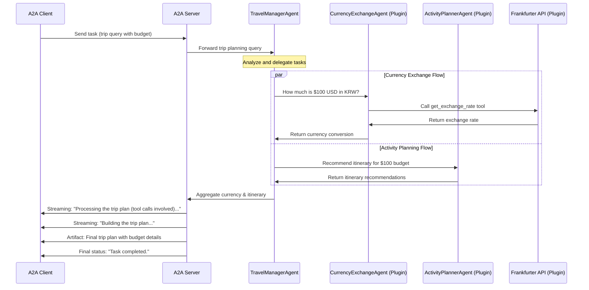

# Semantic Kernel Agent with A2A Protocol

This sample demonstrates how to implement a travel agent built on [Semantic Kernel](https://github.com/microsoft/semantic-kernel/) and exposed through the A2A protocol. It showcases:

- **Multi-turn interactions**: The agent may request clarifications
- **Streaming responses**: Returns incremental statuses
- **Conversational memory**: Maintains context (by leveraging Semantic Kernel's ChatHistory)
- **Push notifications**: Uses webhook-based notifications for asynchronous updates
- **External plugins (SK Agents & Frankfurter API)**: Illustrates how Semantic Kernel Agents are used as plugins, along with APIs, that can be called to generate travel plans and fetch exchange rates



## Prerequisites

- Python 3.10 or higher
- [uv](https://docs.astral.sh/uv/)
- Valid OpenAI/Azure OpenAI or other LLM credentials (depending on your SK setup). See [here](https://learn.microsoft.com/en-us/semantic-kernel/concepts/ai-services/chat-completion/?tabs=csharp-AzureOpenAI%2Cpython-AzureOpenAI%2Cjava-AzureOpenAI&pivots=programming-language-python#creating-a-chat-completion-service) for more details about Semantic Kernel AI connectors that are used with a ChatCompletionAgent.
- Access to a Frankfurter API key (optional, or you can call the free endpoint)

## Setup & Running

1. **Navigate to the samples directory**:

```bash
cd samples/python/agents/semantickernel
```

2. **Create an environment file (.env) with your API key and the model ID (e.g., "gpt-4.1"):**:

```bash
OPENAI_API_KEY="your_api_key_here"
OPENAI_CHAT_MODEL_ID="your-model-id"
```

3. **Set up the Python Environment**:

> Note: pin the Python version to your desired version (3.10+)

```bash
uv python pin 3.12
uv venv
source .venv/bin/activate
```
4. **Run the agent**:

Choose one of the following options:

> Make sure you run `uv run .` from the following directory: `samples/python/agents/semantickernel`

```bash
# Basic run on default port 10020
uv run .
```
or

```bash
# On custom host/port
uv run . --host 0.0.0.0 --port 8080
```

5. **In a separate terminal, run the A2A client:

> Make sure you run `uv run .` from the following directory: `samples/python/hosts/cli`

```bash
cd samples/python/hosts/cli
uv run . --agent http://localhost:10020
```

## Limitations

- Only text-based input/output for now
- Frankfurter API has a limited set of currency conversions
- Session-based memory is ephemeral (in-memory)

## Example Endpoints

You can POST A2A requests to http://localhost:10020 with JSON-RPC specifying tasks/send or tasks/sendSubscribe. Here is a synchronous snippet:

### Request:

POST http://localhost:10020
Content-Type: application/json

```json
{
  "jsonrpc": "2.0",
  "id": 33,
  "method": "tasks/send",
  "params": {
    "id": "3",
    "sessionId": "1aab49f1e85c499da48c2124f4ceee4d",
    "acceptedOutputModes": ["text"],
    "message": {
      "role": "user",
      "parts": [
        { "type": "text", "text": "How much is 1 USD to EUR?" }
      ]
    }
  }
}
```

### Response:

```json
{
  "jsonrpc": "2.0",
  "id": 33,
  "result": {
    "id": "3",
    "status": {
      "state": "completed",
      "timestamp": "2025-04-01T16:53:29.301828"
    },
    "artifacts": [
      {
        "parts": [
          {
            "type": "text",
            "text": "1 USD is approximately 0.88137 EUR."
          }
        ],
        "index": 0
      }
    ],
    "history": []
  }
}
```

And so on for multi-turn, streaming, etc.

For more details, see [A2A Protocol Documentation](https://google.github.io/A2A/#/documentation) and [Semantic Kernel Docs](https://learn.microsoft.com/en-us/semantic-kernel/get-started/quick-start-guide?pivots=programming-language-python).
