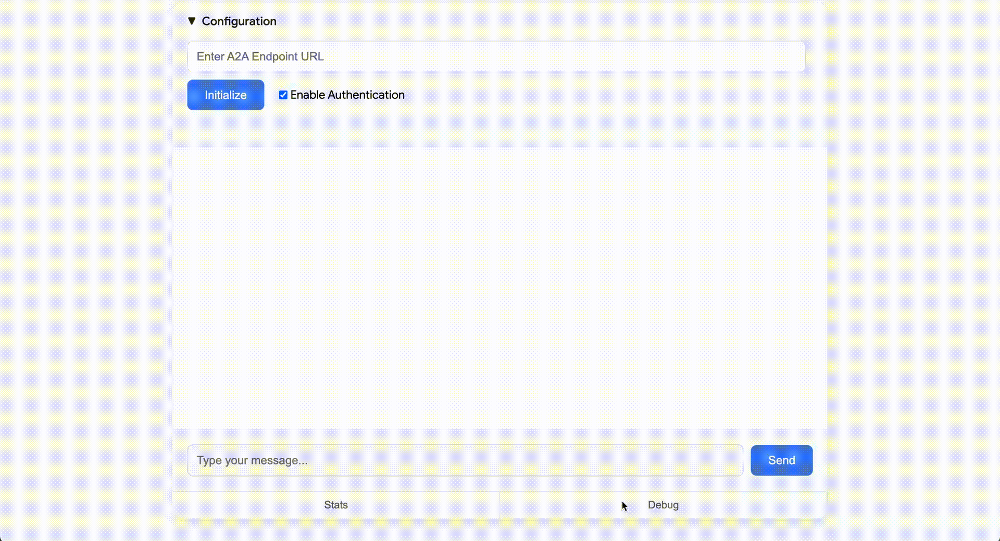

# A2A GUI Client

This application provides a web-based graphical user interface (GUI) to interact with any A2A-compliant agent. It's designed for ease of use, allowing you to connect to an agent, inspect its capabilities, and engage in a conversation through a clean, chat-like interface.

## Demo



## Prerequisites

- Python 3.11+
- `uv`
- Google Cloud SDK (`gcloud`) installed and authenticated.

## Running the Application

1. **Install Dependencies**:

    From the `a2a_gui` directory, install the required packages using `uv`:

    ```bash
    uv pip install -e .
    ```

2. **Start the Server**:

    Run the web server using `uv`:

    ```bash
    uv run uvicorn server:app --host 0.0.0.0 --port 8000
    ```

3. **Connect to the GUI**:

    Open your web browser and navigate to `http://localhost:8000`.

## How Authentication Works (for Local Development)

This GUI includes a convenient feature for **local development and testing** against agents hosted on secure services like Google Cloud Run.

When the "Enable Authentication" checkbox is selected, the application's backend leverages your local Google Cloud SDK configuration. It executes the `gcloud auth print-identity-token` command to generate an identity token for your currently logged-in user. This token is then automatically included as a `Bearer` token in the `Authorization` header of requests sent to the agent's endpoint.

This mechanism provides a seamless way to authenticate with the transport layer (the web service hosting the agent) from your local machine, using your own user credentials. Note that this is a client-side implementation detail for local testing and not part of the A2A protocol itself.

## Disclaimer

This is not an officially supported Google product. The code is provided as-is, without any warranty or support.

This application is designed to interact with A2A agents. As with any application that communicates with external services, it is important to be aware of the potential security risks. Always treat data received from an agent as untrusted input. Failure to do so may lead to security vulnerabilities, including but not limited to prompt injection.
