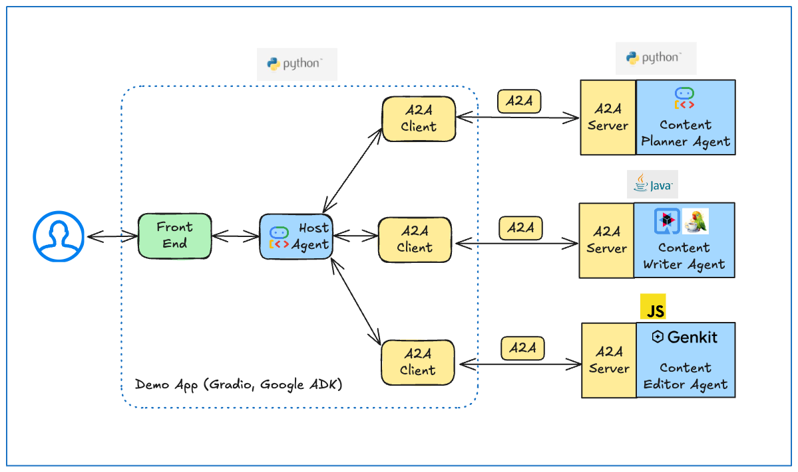
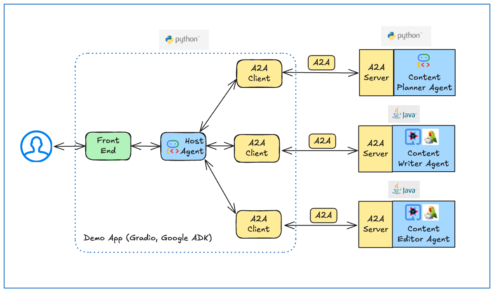
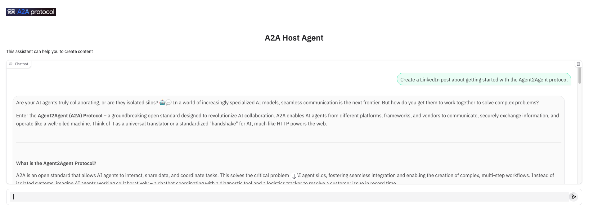

# Multi-Language Agent Collaboration and Interoperability

> *⚠️ DISCLAIMER: THIS DEMO IS INTENDED FOR DEMONSTRATION PURPOSES ONLY. IT IS NOT INTENDED FOR USE IN A PRODUCTION ENVIRONMENT.*
> *⚠️ Important: A2A is a work in progress (WIP) thus, in the near future there might be changes that are different from what demonstrated here.*

This sample highlights how to use the Agent2Agent (A2A) protocol for multi-agent collaboration where multiple
agents, each written in a different programming language, seamlessly work together to accomplish a goal.

The sample also highlights the interoperability made possible by the A2A protocol, demonstrating how an agent
can be easily swapped out for an equivalent agent written in a different programming language. This also permits step-by-step migration of complex systems.

## Architecture

The application features a content creation pipeline with a host agent that routes requests to the appropriate specialized agent:

* **Host Agent** *(Python, Google ADK, A2A Python SDK)*: Acts as the central orchestrator for content creation, dynamically determining which agent to send a request to based on the task at hand.
* **Content Planner Agent** *(Python, Google ADK, A2A Python SDK)*: Receives a high-level description of the content that's needed and creates a detailed content outline.
* **Content Writer Agent** *(Java, Quarkus LangChain4j, A2A Java SDK)*: Generates an engaging piece of content using a content outline.
* **Content Editor Agent** *(TypeScript, Genkit, A2A JS SDK)*: Proof-reads and polishes content.



Later in this sample, we'll swap out the Content Editor Agent for an equivalent agent written in Java that makes use of Quarkus LangChain4j and the A2A Java SDK. This demonstrates the flexibility that's made possible by the A2A protocol.



## App UI



## Setup and Deployment

### Prerequisites

Before running the application locally, ensure you have the following installed:

1. **uv:** The Python package management tool used in this project. Follow the installation guide: [https://docs.astral.sh/uv/getting-started/installation/](https://docs.astral.sh/uv/getting-started/installation/)
2. **python 3.13** Python 3.13 is required to run a2a-sdk

## 1. Run Content Planner Agent
```bash
cd samples/python/agents/content_planner
```

Follow the instructions in the `content_planner` [README.md](../../agents/content_planner/README.md) to start the Content Planner agent.

## 2. Run Content Writer Agent
```bash
cd samples/java/agents/content_writer
```

Follow the instructions in the `content_writer` [README.md](../../../java/agents/content_writer/README.md) to start the Content Writer agent.

## 3. Run JS Content Editor Agent
```bash
cd samples/js/src/agents/content-editor
```

Follow the instructions in the `content-editor` [README.md](../../../js/src/agents/content-editor/README.md) to start the Content Editor agent.

## 4. Run Host Agent
Open a new terminal and run the host agent server:

```bash
cd samples/python/hosts/content_creation
uv run .
```

## 5. Test using the UI

From your browser, navigate to <http://0.0.0.0:8083>.

Here are example questions:

- Create a LinkedPost about getting started with the Agent2Agent protocol
- Create a short, upbeat series of X posts about getting started with Java

## 6. Swap out the Content Editor Agent

### Stop the Host Agent and the Content Editor Agent
We're going to swap out the Content Editor Agent written in TypeScript for an equivalent Content Editor Agent written in Java. This demonstrates how the A2A protocol enables language-agnostic interoperability.

### Start the Java Content Editor Agent

```bash
cd samples/java/agents/content_editor
```

Follow the instructions in the `content_editor` [README.md](../../../java/agents/content_editor/README.md) to start the Content Writer agent.

### Start the Host Agent

```bash
cd samples/python/hosts/content_creation
uv run .
```

### Test using the UI
Test using the UI

From your browser, navigate to <http://0.0.0.0:8083>.

Here are example questions:

- Create a LinkedIn post about getting started with the Agent2Agent protocol
- Create a short, upbeat series of X posts about getting started with Java

## References
- [A2A Python SDK](https://github.com/google/a2a-python)
- [A2A Java SDK](https://github.com/google/a2a-java)
- [A2A JavaScript SDK](https://github.com/google/a2a-js)

## Disclaimer
Important: The sample code provided is for demonstration purposes and illustrates the
mechanics of the Agent-to-Agent (A2A) protocol. When building production applications,
it is critical to treat any agent operating outside of your direct control as a
potentially untrusted entity.

All data received from an external agent—including but not limited to its AgentCard,
messages, artifacts, and task statuses—should be handled as untrusted input. For
example, a malicious agent could provide an AgentCard containing crafted data in its
fields (e.g., description, name, skills.description). If this data is used without
sanitization to construct prompts for a Large Language Model (LLM), it could expose
your application to prompt injection attacks.  Failure to properly validate and
sanitize this data before use can introduce security vulnerabilities into your
application.

Developers are responsible for implementing appropriate security measures, such as
input validation and secure handling of credentials to protect their systems and users.
